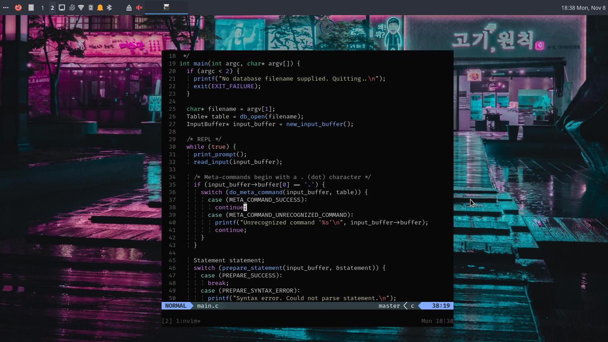
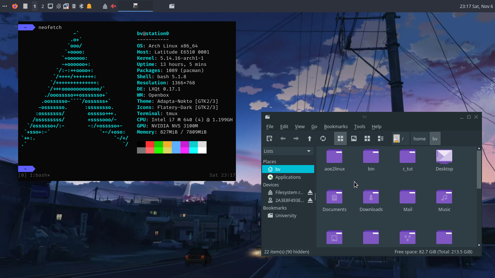

# Dotfiles

This repository contains my dotfiles. Feel free to fork and customize to fit your needs.

Inside folders such as `vim`, or `terminal`, there are more READMEs and screenshots. I have also added descriptive comments where I felt like they were needed.

I use Arch (btw) with LXQt + Openbox. My preferred editor is [Neovim](https://github.com/bihanviranga/dotfiles/tree/master/vim) and my terminal emulator is [kitty](https://github.com/bihanviranga/dotfiles/tree/master/terminal), inside which I usually run tmux. I use this setup for coding. The settings will be mostly useful for writing code and navigating the system in the terminal.

## Installing
There's no install/bootstrap script since I don't think that's how dotfiles should be used (and I don't switch computers often). My personal setup is to symlink the files in this repo to my home directory (i.e: `ln -s <dotfiles-repo>/terminal/bashrc ~/.bashrc`).

## Highlights
Most of the tweaks happen in [Vim](https://github.com/bihanviranga/dotfiles/tree/master/vim) and [the terminal](https://github.com/bihanviranga/dotfiles/tree/master/terminal).

## Utilities and tools
- [LSD](https://github.com/Peltoche/lsd) - `ls` command with more features
- [Bat](https://github.com/sharkdp/bat) - a `cat` clone with wings
- [Bash-completion](https://github.com/scop/bash-completion) - completions for bash commands
- [z](https://github.com/rupa/z) - track and jump to recent folders easily
- [htop](https://hisham.hm/htop/) - terminal task manager
- [NeoVim](https://neovim.io) - vim fork
- [tmux](https://github.com/tmux/tmux/wiki) - terminal multiplexer
- [sdcv](http://dushistov.github.io/sdcv/) - terminal dictionary
- [delta](https://github.com/dandavison/delta) - git diff viewer
- [nnn](https://github.com/jarun/nnn) - file manager for terminal
- [dust](https://github.com/bootandy/dust) - `du` alternative
- [hexyl](https://github.com/sharkdp/hexyl) - hex viewer
- [tuxi](https://github.com/Bugswriter/tuxi) - do quick web searches from the terminal
- [newsboat](https://newsboat.org/) - terminal RSS/Atom feed reader
- [gcalcli](https://github.com/insanum/gcalcli/) - Google Calendar CLI client
- [fd](https://github.com/sharkdp/fd) - alternative to `find`
- [ripgrep](https://github.com/BurntSushi/ripgrep) - search directories for a regex pattern
- [zathura](https://github.com/pwmt/zathura) - document viewer

Distros I have tried and liked, from oldest to latest:
- Ubuntu 14.04
- Debian 7
- Crunchbangplusplus
- Linux Mint 19 Tara
- Arch Linux
