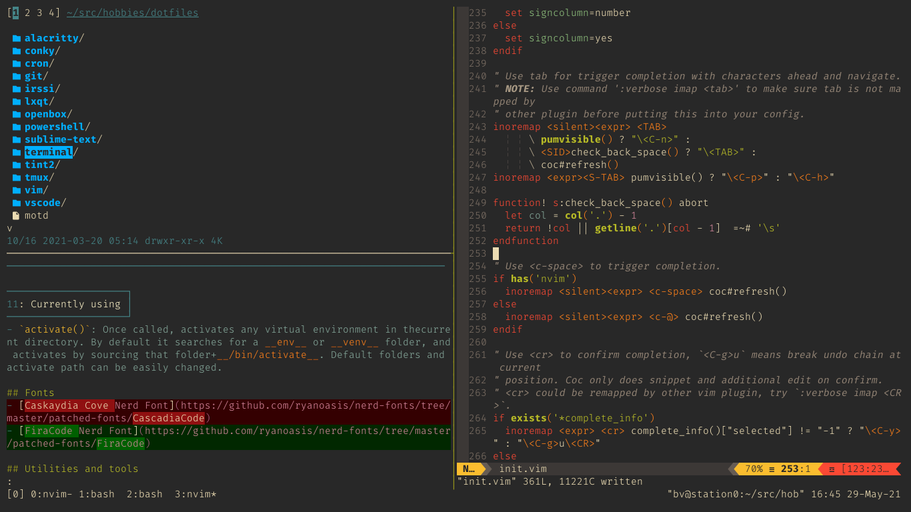

# Terminal Emulator and Bash

Currently using
- ~~Qterminal~~
- ~~Konsole~~
- Alacritty

## Functions
- `activate()`: Once called, activates any virtual environment in thecurrent directory. By default it searches for a __env__ or __venv__ folder, and activates by sourcing that folder+__/bin/activate__. Default folders and activate path can be easily changed.

## Fonts
- [FiraCode Nerd Font](https://github.com/ryanoasis/nerd-fonts/tree/master/patched-fonts/FiraCode)

## Utilities and tools
- [LSD](https://github.com/Peltoche/lsd) - `ls` command with more features - LSDelux
- [Bat](https://github.com/sharkdp/bat) - a `cat` clone with wings
- [Bash-completion](https://github.com/scop/bash-completion) - completions for bash commands
- [z](https://github.com/rupa/z) - track and jump to recent folders easily
- [htop](https://hisham.hm/htop/) - terminal task manager
- [NeoVim](https://neovim.io) - vim fork with more features
- [tmux](https://github.com/tmux/tmux/wiki) - terminal multiplexer
- [sdcv](http://dushistov.github.io/sdcv/) - terminal dictionary
- [delta](https://github.com/dandavison/delta) - git diff viewer
- [nnn](https://github.com/jarun/nnn) - file manager for terminal
