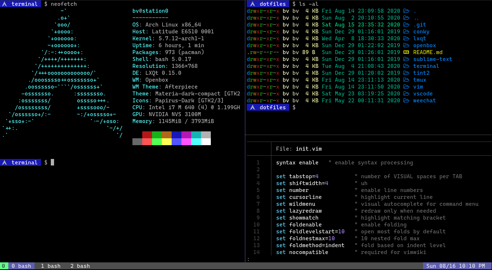

# Terminal Emulator and Bash

Currently using 
- Qterminal

## Fonts
- [Caskaydia Cove Nerd Font](https://github.com/ryanoasis/nerd-fonts/tree/master/patched-fonts/CascadiaCode)

## Utilities and tools
- [LSD](https://github.com/Peltoche/lsd)
- [Bat](https://github.com/sharkdp/bat)
- [Bash-completion](https://github.com/scop/bash-completion)
- [z](https://github.com/rupa/z)
- [htop](https://hisham.hm/htop/)
- [NeoVim](https://neovim.io)
- [tmux](https://github.com/tmux/tmux/wiki)
