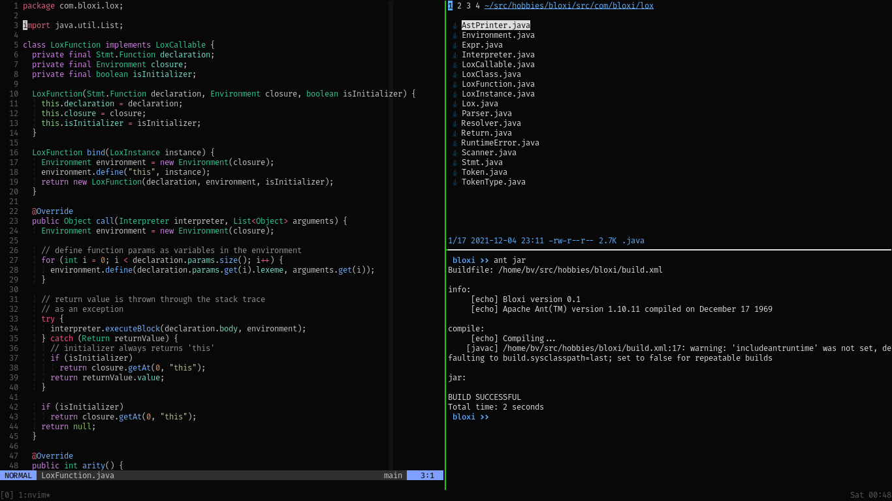

# Bash and other things

These files contain my settings for the bash terminal. For terminal emulator settings, see [here.](https://github.com/bihanviranga/dotfiles/tree/master/kitty) For tmux settings, see [here.](https://github.com/bihanviranga/dotfiles/tree/master/tmux)
Older screenshots are in the `old` directory. The filename is also a commit hash, showing the repository's latest commit when the screenshot was taken.

Currently using
- ~~Qterminal~~
- ~~Konsole~~
- ~~Alacritty~~
- Kitty

## Files
Bash aliases and functions are split into seperate files. These files are sourced from `.bashrc`
- `bashrc_alias`: Contains all the bash aliases.
- `bashrc_functions`: Contains bash functions.
- `lesskey`: Settings for `less` pager. Place this in `~/.lesskey`
- `inputrc`: Bash inputrc file.
- `scripts`: [This](https://github.com/bihanviranga/dotfiles/tree/master/terminal/scripts) directory contains some simple bash scripts with descriptions.

## Functions
- `activate()`: Once called, activates any Python virtual environment in the current directory. By default it searches for a __env__ or __venv__ folder, and activates by sourcing that folder+ __/bin/activate__.
- `mkd()`: Create a folder and cd into it.
- `n()`: NNN file manager with CD-on-quit feature.
- `gitlog_screen()`: Print `git log --oneline` to fill the entire terminal screen.
- `fname()`: Get the name of a file and copy it to clipboard. (Eg: `fname somefile.cpp`, and the full path to somefile.cpp is in your clipboard now)

## Fonts
- [FiraCode Nerd Font](https://github.com/ryanoasis/nerd-fonts/tree/master/patched-fonts/FiraCode)(Pictured)
- [JetBrains Mono](https://www.jetbrains.com/lp/mono/)
- [Fantasque Sans Mono](https://github.com/ryanoasis/nerd-fonts/tree/master/patched-fonts/FantasqueSansMono)
