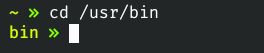

# PS1


`PS1="[\[$(tput sgr0)\]\[$(tput bold)\]\[\033[38;5;10m\]\u@\h\[$(tput sgr0)\] \[$(tput sgr0)\]\[$(tput bold)\]\[\033[38;5;4m\]\W\[$(tput sgr0)\]]\\$ \[$(tput sgr0)\]"`

---


`PS1="\[\033[44m\]   \[\033[1;37m\]\W \[\033[0m\] \$ "`

---


`PS1="   \W \$ "`

---


`PS1=" \e[36m\e[37m \W \$ "`

---



```bash
COL_DFFF00="\[\033[01;38;5;190m\]"
COL_87FF00="\[\033[01;38;5;118m\]"
COL_RESET="\[\033[0m\]"
PS1=" ${COL_DFFF00}\W ${COL_87FF00}${COL_RESET} "
```
[PS1](6.png)

```bash
COL_5FAFFF="\[\033[01;38;5;75m\]"
COL_5F5FFF="\[\033[01;38;5;63m\]"
COL_RESET="\[\033[0m\]"
PS1=" ${COL_5FAFFF}\W ${COL_5F5FFF}${COL_RESET} "
```
