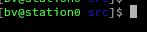
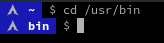

# PS1 

`PS1="[\[$(tput sgr0)\]\[$(tput bold)\]\[\033[38;5;10m\]\u@\h\[$(tput sgr0)\] \[$(tput sgr0)\]\[$(tput bold)\]\[\033[38;5;4m\]\W\[$(tput sgr0)\]]\\$ \[$(tput sgr0)\]"`

`PS1="\[\033[44m\]   \[\033[1;37m\]\W \[\033[0m\] \$ "`

