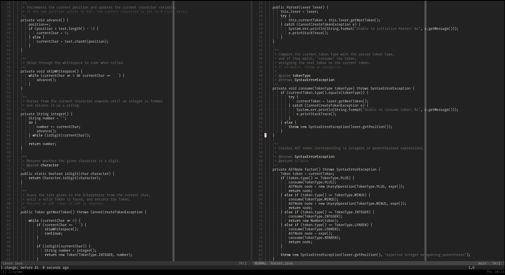

# Vim Configuration

- Vim distribution : [NeoVim](https://neovim.io)

> Currently I am experimenting with [LazyVim](https://www.lazyvim.org)

Vim configuration is done using Lua. Refer to `init.lua`.
A list of plugins I use can be found in the `lua/plugins.lua` file.
I use Neovim's native LSP. I used CoC before, and the native LSP seems to offer a better performance. The configuration for the LSP can be found in `lua/lspconf.lua`. It also contains the Treesitter config.
I use Telescope for searching for all lists, like files, buffers, diagnostics, etc. The config is in `lua/telescopeconf.lua`.
